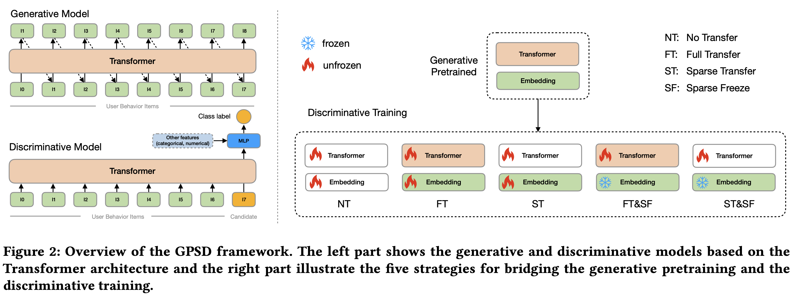

# Official code of GPSD

## GPSD
The GPSD (**G**enerative **P**retraining for **S**calable **D**iscriminative Recommendation) framework, proposed in the KDD25 paper [Scaling Transformers for Discriminative Recommendation via Generative Pretraining](https://arxiv.org/pdf/2506.03699), aims to scale up Transformer for discriminative recommendation tasks like CTR and CVR prediction, which play key roles in modern industrial recommendation systems.
The framework consists of two stages: 1) the generative pretraining stage and 2) the discriminative training stage. In the generative pretraining stage, a Transformer is trained to autoregressively predict the next item in user behavior sequences, similar to training a language model. In the discriminative training stage, the pretrained parameters are fully or partially transferred to initialize a discriminative model, which is then trained to predict user actions, taking user behavior items and a candidate item as input. We also use Transformer in the discriminative stage but other architectures are also adoptable. In the second training stage, sparse parameters are frozen to prevent overfitting and thus facilitate model scalability.


## Setup
Run the following command to install dependencies:
```
pip install -r requirements.txt
```

## Prepare data

### Amazon-food
```
wget https://jmcauley.ucsd.edu/data/amazon_v2/categoryFilesSmall/Grocery_and_Gourmet_Food_5.json.gz
wget https://mcauleylab.ucsd.edu/public_datasets/data/amazon_v2/metaFiles2/meta_Grocery_and_Gourmet_Food.json.gz
gunzip Grocery_and_Gourmet_Food_5.json.gz
gunzip meta_Grocery_and_Gourmet_Food.json.gz
mkdir dataset/amazon_food/
mv Grocery_and_Gourmet_Food_5.json dataset/amazon_food/
mv meta_Grocery_and_Gourmet_Food.json dataset/amazon_food/
python dataset/preprocessing_amazon_food.py
```


## Train model

Available MODEL_IDs: deepfm, din, dien, dmin, l4h32a4, l4h64a4, l4h128a4, l4h256a4

Note: l4h32a4, l4h64a4 and l4h128a4, l4h256a4 are Transformer-based models.

### Amazon-food
- Training baseline models
```
python ./src/train.py --config ./config/amazon_food/[MODEL_ID].gin
```

- GPSD: Pretraining
```
python ./src/train.py --config ./config/amazon_food/[MODEL_ID]_pretrain.gin
```
Available MODEL_IDs for pretraining are: l4h32a4, l4h64a4, l4h128a4, l4h256a4

- GPSD: Discriminative training
```
python ./src/train.py --config ./config/amazon_food/[MODEL_ID]_stsf.gin
```

Note: remember to replace the `[MODEL_ID]` placeholder with your desired value.


## Monitor Metrics
To monitor the training metrics, run the following command

```tensorboard --logdir ./output/```

## Citation
If this work is useful to you, please cite our paper:
```
@inproceedings{wang2025scaling,
  title={Scaling Transformers for Discriminative Recommendation via Generative Pretraining},
  author={Wang, Chunqi and Wu, Bingchao and Chen, Zheng and Shen, Lei and Wang, Bing and Zeng, Xiaoyi},
  booktitle={the 31st ACM SIGKDD Conference on Knowledge Discovery and Data Mining V.2 (KDD ’25)},
  year={2025}
}
```